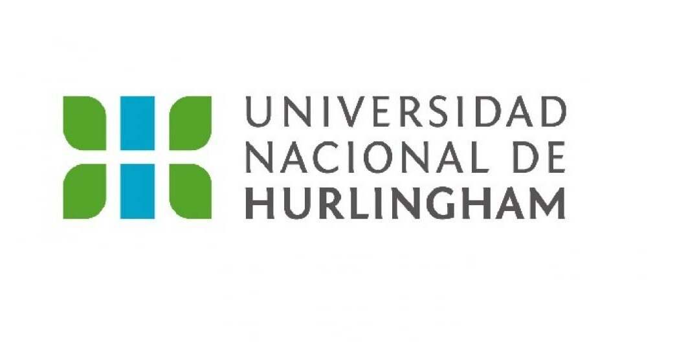
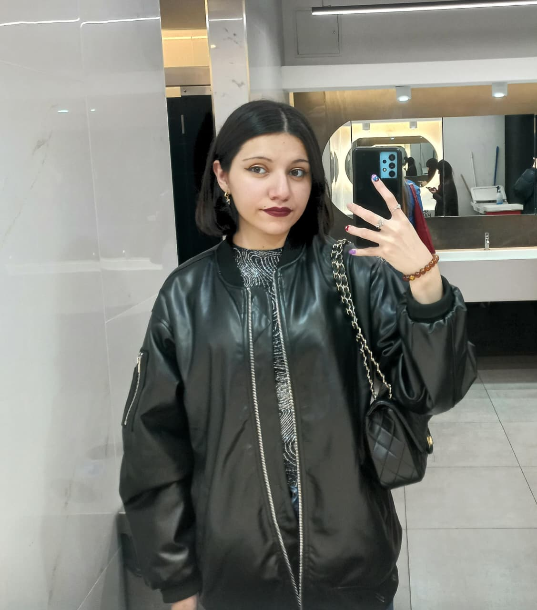

---

# 🖥️Presentacion personal

<table>
  <tr>
    <td width="60%">
      Hola a tod@s! Me presento, soy <b>Lemo Fernanda Abigail Rita</b> y tengo 20 años.  
      Actualmente estoy estudiando <i>"Licenciatura en Informática"</i> en la <b>Universidad Nacional de Hurlingham (UNAHUR)</b>.  
      Me interesa mucho la tecnología y seguir aprendiendo cosas nuevas a diario.
    </td>
    <td width="40%" align="center">
      
    </td>
  </tr>
</table>

<table>
  <tr>
    <td width="40" align="center">
      
    </td>
    <td width="65%">
      <h3>🛠️ Lenguajes y Herramientas</h3>
      

        
        
        
        
        
      

    <b>🟢 Aprendido:</b>
      <ul>
        <li><b>Gobstones</b> <i>(Programación Estructurada)</i></li>
      </ul> 
      

      <b>🟡 En Proceso:</b>
      <ul>
        <li><b>HTML5 & CSS</b>
        <li><b>JavaScript</b></li>
        <li><b>Git & GitHub</b> 
        

      </ul>
  </tr>
</table>

# 📚 Materias que estoy cursando

<table>
  <tr>
    <td width="65%">
    
🏛️ <b>Universidad Nacional de Hurlingham (UNAHUR)</b> | 📅 <i>2026</i>

      <ul>
        <li><b>Materia 1:</b> Programacion con Objetos 1 </li>
        <li><b>Materia 2:</b> Organizacion de Computadoras 1</li>
      </ul>
    </td>
    <td width="35%" align="center">
     
    </td>
  </tr>
</table>

  

 

# 👩🏻‍💻 Informacion sobre mi

 
  <table width="100%">
  <tr>
    <td width="50%" align="center">
      
En 2021, en plena pandemia y cuando tenía 15 años, realicé un curso gratuito de 3 meses llamado <b>"Yo puedo programar"</b> de <i>Junior Achievement Argentina</i>, el cual trataba de crear tu primera página web viendo contenidos básicos de HTML, CSS y JavaScript.

      
Fue gracias a ese curso que terminé de confirmar mi vocación y entonces decidí que la informática era la rama ideal para lo que me gustaba.

         
      
    </td>
    <td width="50%" align="center">
      
Desde chica siempre me ha llamado la atención el mundo de la tecnología. Recuerdo pasar horas explorando los teléfonos antiguos —como los clásicos Nokia de mis papás—.

      
Me daba curiosidad entender qué había "detrás" de cada aplicación y cómo funcionaban por dentro.

      
Hoy sigo conservando esa misma curiosidad en mi carrera: sigo estudiando para explorar cómo funciona el software por dentro y transformar esa fascinación en herramientas y proyectos para mi futuro.

       
      
    </td>
  </tr>
</table>

<table>
  <tr>
   <td width="40%" align="center">
      
    </td>
    <td width="60%">
    <ul>
    

    <b>Mas sobre mi</b>
    
· · ─ ·ʚɞ· ─ · ·
    <li>Me gusta leer libros (mas sobre fantasia y romance), ver kdramas y armar playlists de musica para cualquier momento!</li>
    
    <li>Mis artistas favoritos son: Ariana Grande, Taylor Swift, Gracie Abrams, entre otros mas!! </li>
     
    <li> Me gusta ver muchas peliculas como fantasia, o esa gestetica dark, ya sea Coraline, Las cronicas de Narnia,etc. y me gusta maratonear en mis tiempos libres clasicos de los 2000!
      </ul>
     </td>
     

  </tr>
</table>

---
 

  <b>Gracias por ver!</b> 

